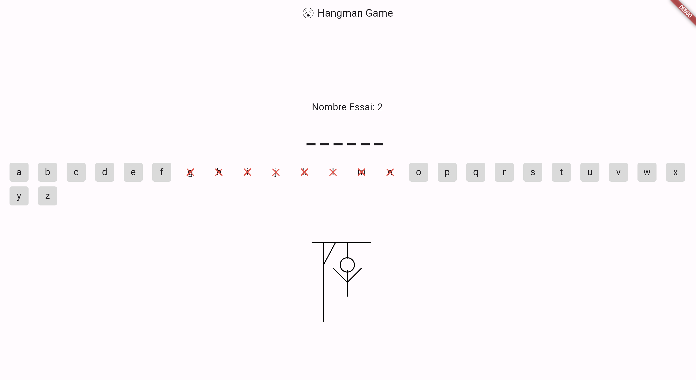

# Jeu du Pendu

Un jeu du pendu simple implémenté en utilisant Flutter.

## Aperçu

Il s'agit d'une implémentation basique du jeu du pendu, où le joueur doit deviner le mot en proposant des lettres dans un certain nombre de tentatives.

## Fonctionnalités

- Démarrer une nouvelle partie avec un mot aléatoire
- Entrer un mot personnalisé pour jouer
- Suivi du nombre de tentatives restantes
- Affichage de l'historique des parties avec les résultats (victoire/défaite)
- Dessiner la figure du pendu au fur et à mesure des mauvaises réponses

## Captures d'écran



## Pour commencer

### Prérequis

- [Flutter SDK](https://flutter.dev/docs/get-started/install)
- [Dart SDK](https://dart.dev/get-dart)
- Un éditeur de code (VS Code, Android Studio, etc.)

### Installation

1. Cloner le dépôt :
   ```bash
   git clone https://github.com/votreutilisateur/jeu_du_pendu.git
   cd jeu_du_pendu

2. Récupérer les packages Flutter :
    ```bash
    flutter pub get

## Exécution de l'application
Connectez un émulateur ou un appareil physique.

3. Exécutez l'application :
    ```bash
    flutter run

Structure du code
- main.dart : Le point d'entrée principal de l'application.
- HangmanGamePage : Le widget avec état qui gère la logique principale du jeu et l'interface utilisateur.
- HangmanPainter : Un peintre personnalisé pour dessiner la figure du pendu.
- HangmanGameResult : Une classe pour suivre le résultat de chaque partie.

## Comment jouer ?

- Entrez un mot personnalisé ou commencez une partie avec un mot aléatoire.
- Devinez les lettres en les tapant.
Vous avez 10 tentatives pour deviner le mot correctement.
- Le jeu se termine lorsque vous devinez le mot ou que vous manquez de tentatives.
- Consultez l'historique des parties pour voir vos résultats précédents.

## Contribuer
Les contributions sont les bienvenues ! Veuillez forker le dépôt et soumettre une pull request pour toute fonctionnalité, amélioration ou correction de bug.

## Forkez le dépôt.
- Créez une nouvelle branche (git checkout -b feature-branch).
- Commitez vos changements (git commit -am 'Ajouter nouvelle fonctionnalité').
- Pushez la branche (git push origin feature-branch).
- Créez une nouvelle Pull Request.
## Licence
Ce projet est sous licence MIT - voir le fichier LICENSE pour plus de détails.

## Fonctionnalités à venir
- Possibilité de jouer à 2 sur un même écran.
- Système de sauvegarde pour pouvoir reprendre le cours de sa partie et enregistrer les scores.


