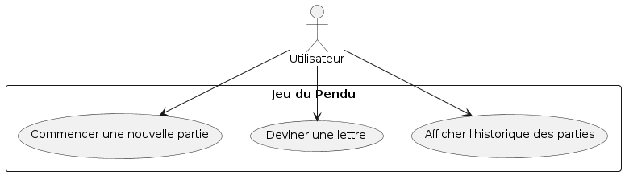

# Cahier des charges - Jeu du Pendu
## Contexte
Le jeu du Pendu est un classique qui consiste à deviner un mot en proposant des lettres, avec un nombre limité de tentatives. Ce projet vise à créer une version simple du jeu en utilisant Flutter.

## Objectifs
Développement d'un jeu du Pendu : Permettre aux utilisateurs de jouer à un jeu du Pendu.
Interface utilisateur intuitive : Fournir une interface claire et facile à utiliser pour le jeu.
Suivi des scores : Enregistrer et afficher l'historique des parties jouées avec les résultats (victoire/défaite).
## Acteurs
Utilisateur : La personne qui joue au jeu du Pendu.
Périmètre et cas d’utilisation
## Cas d'utilisation principaux
Commencer une nouvelle partie : L'utilisateur peut démarrer une nouvelle partie avec un mot aléatoire ou personnalisé.
Deviner une lettre : L'utilisateur peut entrer des lettres pour deviner le mot.
Afficher l'historique des parties : L'utilisateur peut consulter l'historique des parties précédentes avec les résultats.
## Diagramme de cas d'usage fonctionnel

## Règles métier
- Le joueur a 10 tentatives pour deviner le mot.
- Le mot doit être caché avec des underscores _ - Pour chaque lettre non devinée.
Le jeu doit indiquer le nombre de tentatives restantes.
- Un historique des parties doit être conservé avec les résultats (victoire/défaite).
Description textuelle du cas d’utilisation principal : “Commencer une nouvelle partie”
Identification
But : Démarrer une nouvelle partie du jeu du Pendu.
- Acteur principal : Utilisateur
Flux d’évènements
Enchaînement nominal
- L'utilisateur appuie sur "Nouvelle Partie".
- L'utilisateur choisit entre un mot aléatoire ou un mot personnalisé.
- Le système affiche le mot à deviner caché par des underscores _.
- L'utilisateur commence à deviner les lettres.
### Enchaînements alternatifs
- Le mot personnalisé est vide :
    Le système affiche un message d'erreur et demande un mot valide.
-Description textuelle du scénario “L'utilisateur devine des lettres”
    Identification
- But : Permettre à l'utilisateur de deviner les lettres du mot.

## Déroulement
1. L'utilisateur propose une lettre.
Le système vérifie si la lettre est dans le mot.
Si la lettre est correcte, le système affiche la lettre à la position appropriée.
2. Si la lettre est incorrecte, le système décrémente le nombre de tentatives restantes.
3. Le jeu continue jusqu'à ce que le mot soit deviné ou que le nombre de tentatives atteigne zéro.
   
## Exigences fonctionnelles
- Le système doit permettre de démarrer une nouvelle partie.
- Le système doit permettre à l'utilisateur de deviner des lettres.
- Le système doit afficher le mot à deviner avec des underscores pour les lettres non devinées.
- Le système doit afficher le nombre de tentatives restantes.
- Le système doit conserver un historique des parties avec les résultats.
## Exigences non fonctionnelles
- Le système doit être facile à installer et à utiliser.
- Le système doit fonctionner sur les appareils Android et iOS.
- Le système doit avoir une interface utilisateur intuitive et réactive.
## Contraintes
- Le système doit fonctionner sans connexion Internet.
- Le système doit être développé en utilisant Flutter pour assurer la compatibilité multiplateforme.
## Prestations attendues
Documentation utilisateur : Guide d'installation et manuel d'utilisation.
Code source : Accès au dépôt GitHub contenant le code source du projet.
Tests : Tests unitaires et fonctionnels pour valider les fonctionnalités.
Planning
### Itération 1
Développement de l'interface utilisateur.
Implémentation des fonctionnalités de base : démarrage de partie, deviner des lettres, affichage des tentatives restantes.
## Installation
Développeur·se
Voir le README du dépôt hébergeant le code source.

